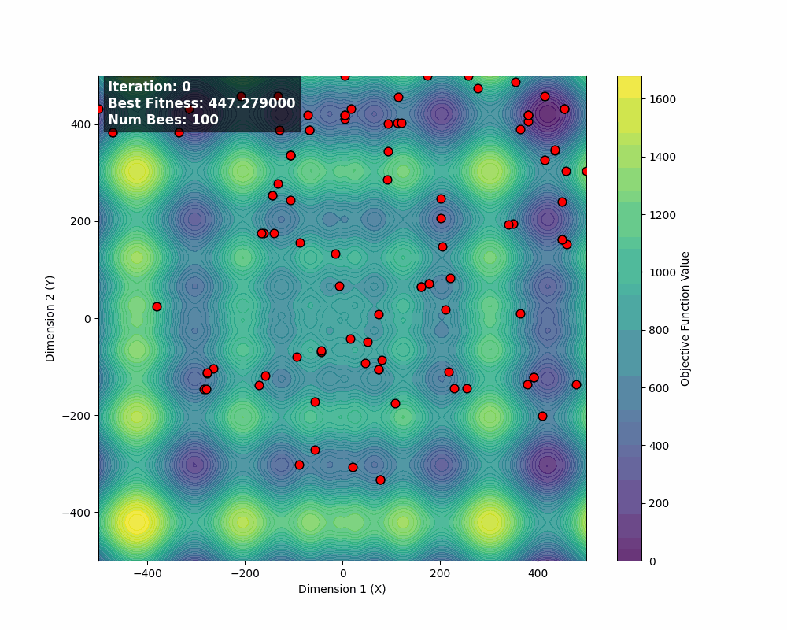

# Artificial Bee Colony Algorithm | Parallel MPI
## Overview

The **Artificial Bee Colony (ABC)** algorithm is a **population-based metaheuristic optimization algorithm** inspired by the **foraging behavior of honey bee swarms**. It was introduced by **Dervis Karaboga (2005)** and is particularly effective for **continuous optimization problems**.

ABC belongs to the family of **swarm intelligence algorithms**, alongside Particle Swarm Optimization (PSO) and Ant Colony Optimization (ACO).

<p align="center">
  
  
  <br>
  <em>
    Figure 1: Convergence on Schwefel function
    (num_proc = 4, num_bees = 100, iter_num = 100, max_trials = 10)
  </em>
</p>

## How to compile and run

This program uses **MPI** for parallel execution.  
It works with any number of processes, provided that the **number of bees is a multiple of the number of processes**.

### Requirements
- MPI installation (e.g. OpenMPI or MPICH)
- `mpicxx` and `mpiexec` available in your PATH

### Compilation

Compile the program using `mpicxx`:

```bash
mpicxx -o exe main.cc
```

### Execution
Run the program with:
```bash
mpiexec -np <num_proc> ./exe <num_bees> <iter_num> <max_trials>
```
**Example**
```bash
mpiexec -np 4 ./exe 100 1000 10
```

---

## Biological Inspiration

In nature, honey bees collectively search for food sources (flower patches) and share information about their quality through a **waggle dance**. The colony is divided into three types of bees:

- **Employed Bees** – exploit known food sources  
- **Onlooker Bees** – select food sources based on shared information  
- **Scout Bees** – explore the environment randomly to find new food sources  

In ABC, **food sources represent candidate solutions**, and their **nectar amount corresponds to solution quality (fitness)**.

## Algorithm Structure

### Population Representation

- Each **food source** corresponds to a solution vector  

  $$
  \mathbf{x}_i = (x_{i1}, x_{i2}, \dots, x_{iD})
  $$

- Each food source has a fitness value
  
## Phases of the ABC Algorithm

### 1. Employed Bee Phase

Each employed bee modifies its current solution by interacting with a randomly chosen neighbor:

$$
v_{ij} = x_{ij} + \phi_{ij}(x_{ij} - x_{kj})
$$

where:
- $k \neq i$ is a randomly selected solution
- $j$ is a randomly selected dimension
- $\phi_{ij} \in [-1, 1]$ is a random number

A **greedy selection** keeps the better solution between $\mathbf{x}_i$ and $\mathbf{v}_i$.

### 2. Onlooker Bee Phase

Onlooker bees choose food sources probabilistically based on fitness:

$$
p_i = \frac{fit_i}{\sum_{n=1}^{SN} fit_n}
$$

Food sources with higher fitness attract more onlookers, increasing exploitation of promising regions.

### 3. Scout Bee Phase

If a food source cannot be improved for a predefined number of trials (`limit`), it is abandoned.

The employed bee becomes a scout and generates a **new random solution**:

$$
x_{ij} = x_j^{\min} + rand(0,1) \cdot (x_j^{\max} - x_j^{\min})
$$

This mechanism prevents premature convergence.

## Fitness Evaluation

For minimization problems, fitness is often defined as:

$$
fit_i =
\begin{cases}
\frac{1}{1 + f_i} & f_i \ge 0 \\
1 + |f_i| & f_i < 0
\end{cases}
$$

where $f_i$ is the objective function value.


## Termination Criteria

The algorithm stops when one of the following conditions is met:

- Maximum number of iterations reached
- Acceptable solution quality achieved

---
